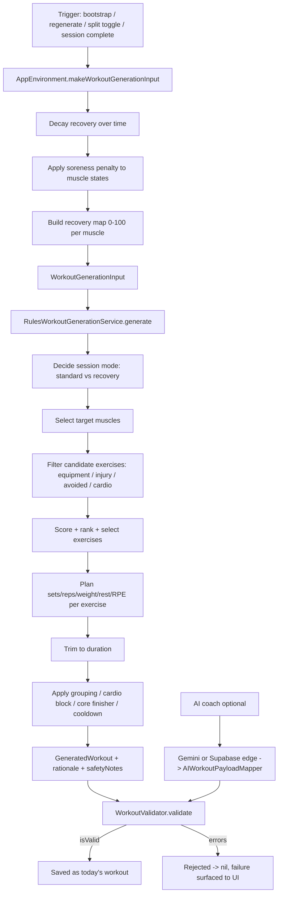

# HotBod — Training Generation Algorithm: Researcher's Reference

**Audience:** A researcher (exercise scientist / ML engineer / algorithm designer) who will
extend, tune, or replace HotBod's workout-generation logic. This document explains **what
the system does, how it does it, and what design principles / exercise-science assumptions it
encodes** — down to the exact constants and source locations, so that you can reason about it
without reading every line of Swift first.

> If you only read one thing: HotBod generates a single day's workout with a **deterministic,
> rules-based engine** (no ML in the loop today). Every generated or AI-proposed plan is then
> passed through an independent **safety validator**. The engine's job is to pick *which muscles*
> to train, *which exercises* cover them, and *how many sets/reps/kg/rest* to prescribe, subject
> to recovery, equipment, injury, goal, and volume constraints.

---

## 0. Where to look in the code

| Concern | File |
|---------|------|
| **Rules engine + validator** (the core) | `HotBod/Services/WorkoutGeneration/WorkoutGenerationService.swift` |
| Pure scoring / selection / ordering / duration | `HotBod/Domain/Algorithms/WorkoutGenerationAlgorithms.swift` |
| **All tunable constants & thresholds** | `HotBod/Domain/Algorithms/GenerationConstants.swift` |
| Recovery, fatigue, overload, volume, deload, e1RM | `HotBod/Domain/Algorithms/Algorithms.swift` |
| Substitution, deload detector, volume caps, protein, strength scores | `HotBod/Domain/Algorithms/Phase2Algorithms.swift` |
| Split rotation / scheduling | `HotBod/Domain/Algorithms/TrainingSchedule.swift` |
| Warm-up / cooldown / cardio-block structure | `HotBod/Domain/Algorithms/SessionStructurePlanner.swift`, `WorkoutGenerationAlgorithms.swift` (`WarmupSetPlanner`) |
| Supersets / circuits | `HotBod/Domain/Algorithms/ExerciseGroupPlanner.swift` |
| Core finisher | `HotBod/Domain/Algorithms/CoreFinisherPlanner.swift` |
| Max-effort / calibration sets | `HotBod/Domain/Algorithms/MaxEffortPlanner.swift` |
| Per-exercise prescription overrides | `HotBod/Domain/Models/ExercisePrescriptionOverrides.swift` + `Resources/ExercisePrescriptionOverrides.json` |
| Prescription/metric resolution (reps vs time vs distance) | `HotBod/Domain/Models/ExerciseMetadataResolver.swift` |
| Domain types & enums | `HotBod/Domain/Models/DomainModels.swift`, `HotBod/Domain/Enums/DomainEnums.swift` |
| Exercise catalog (curated data) | `HotBod/Resources/ExerciseSeed.json`, `ExerciseContent.json` |
| Orchestration (when/how generation is triggered) | `HotBod/App/AppEnvironment+Workout.swift` |
| AI path (optional overlay) | `HotBod/Services/AI/*`, `supabase/functions/_shared/validate.ts` |
| Unit tests for algorithms | `HotBod/Tests/UnitTests/*DomainTests.swift`, `Phase2AlgorithmsTests.swift` |

There is also an older, narrative critique doc: `WORKOUT_GENERATION_LOGIC.md`. It predates some
of the current code (recovery mode, per-exercise overrides, superset grouping, load-tracking
modes). **This document supersedes it** for accuracy.

---

## 1. Design principles (what the algorithm is *based on*)

HotBod is **not** a copy of any competitor and does not use their data. Its logic is built on a
small number of mainstream, defensible resistance-training principles, encoded as explicit rules:

1. **Movement-pattern taxonomy, not just muscles.** Exercises are classified by *movement
   pattern* (`horizontalPush`, `verticalPull`, `squat`, `hinge`, `lunge`, `carry`, `rotation`,
   `antiRotation`, `isolation`, `cardio`, `mobility`) and by *mechanics* (`compound` vs
   `isolation`). Patterns drive diversity, ordering, and injury screening.
2. **Recovery-gated muscle selection.** Each muscle group carries a 0–100 % "recovery" state that
   *decays upward* over time and *drops* after training. The engine preferentially trains the
   most-recovered muscles and refuses to hammer critically fatigued ones. This is a simplified
   fitness–fatigue / supercompensation model.
3. **Goal-driven prescription.** Rep ranges, rest, and RPE targets follow textbook strength /
   hypertrophy / fat-loss / conditioning heuristics (low reps + long rest for strength; moderate
   reps for hypertrophy; higher reps + short rest for fat loss).
4. **Autoregulation via RPE/RIR.** Progression uses logged **Rating of Perceived Exertion (RPE)**
   / **Reps in Reserve (RIR)** to scale load changes, not just "did you finish all reps."
5. **Volume landmarks & deload.** Weekly working-set volume is capped by experience and reduced by
   soreness; sustained over-reaching or a volume crash triggers deload / re-entry states. This is
   a pragmatic take on MEV/MRV (minimum-effective / maximum-recoverable volume) thinking.
6. **Progressive overload with 1RM estimation.** Load suggestions use an Epley one-rep-max
   estimate and trend-aware increments.
7. **Safety-first, generate-then-validate.** The generator and an *independent* validator are two
   separate stages. Even AI-proposed plans must pass the validator. The generator tries to *avoid*
   unsafe plans; the validator is the backstop that can reject them.
8. **Local-first & deterministic.** Everything runs on-device from a curated JSON catalog. The
   only non-determinism is an optional small **score jitter** for variety (seedable for tests).

These are heuristics, not fitted models. A major opportunity for research is to replace or
augment the hand-tuned constants (Section 12) with data-driven parameters.

---

## 2. End-to-end pipeline



**Key architectural choice:** the rules engine *owns* the default daily plan. The AI coach is an
optional overlay that produces a `GeneratedWorkout` which must pass the *same* client validator
(and, for Supabase, a server validator) before it can be applied.

---

## 3. Inputs — `WorkoutGenerationInput`

Assembled in `AppEnvironment+Workout.makeWorkoutGenerationInput`. Everything the engine sees:

```974:989:HotBod/Domain/Models/DomainModels.swift
struct WorkoutGenerationInput: Codable {
    let userProfile: UserProfile
    let goal: TrainingGoal
    let experienceLevel: ExperienceLevel
    let availableEquipment: [Equipment]
    let targetDurationMinutes: Int
    let preferredMuscleGroups: [MuscleGroup]
    let avoidedMuscleGroups: [MuscleGroup]
    let injuries: [BodyLimitation]
    let recentWorkouts: [WorkoutSessionSummary]
    let muscleRecovery: [MuscleGroup: Double]
    let exerciseStats: [UserExerciseStats]
    let userPreferences: WorkoutPreferences
    let readiness: ReadinessInput?
    let splitDayFocus: SplitDayFocus?
}
```

Notable sub-inputs:

- **`muscleRecovery: [MuscleGroup: Double]`** — 0–100 % per muscle. Built *before* the engine runs
  by `RecoveryCalculator` (decay + fatigue + soreness). Missing muscles are treated as **100 %**
  (`GenerationConstants.Recovery.defaultMuscleRecovery`).
- **`readiness`** — `sleepScore` (0–100, from HealthKit; optional) and `soreness`
  (`none/mild/moderate/severe`, user-reported or manual).
- **`exerciseStats: [UserExerciseStats]`** — per-exercise learned history: last weight, suggested
  next weight, estimated 1RM, recent sets, preferred rep range, volume trend, deload state,
  sessions-since-max-effort, etc. This is how the plan "remembers" the user.
- **`splitDayFocus`** — which day of the split rotation we're generating (`upper/lower/push/pull/
  legs/fullBody`, or `nil` for adaptive).
- **`userPreferences`** — avoided/favorite exercise IDs and an `exerciseVariability` level
  (`consistent/balanced/varied`) controlling the variety jitter.

`UserProfile` additionally carries structural toggles the engine reads: `includeWarmupSets`,
`includeCooldown`, `includeCoreFinisher`, `includeConditioning`, `cardioBlockPlacement`,
`preferredExerciseGrouping` (off/supersets/circuits), `maxAvailableWeightKg` (per-equipment
ceilings), and `weightKg` (bodyweight, used for start-weight and volume-cap math).

---

## 4. The exercise catalog (curated, not generated)

Exercises are **hand-curated JSON**, not synthesized. There are ~90 seed exercises.

- `Resources/ExerciseSeed.json` — canonical list: id, name, primary/secondary muscles, equipment,
  `movementPattern`, `difficulty`, `mechanics` (compound/isolation), instructions, form cues,
  common mistakes, seeded `substitutions`, demo videos.
- `Resources/ExerciseContent.json` — overlays: substitution groups, aliases, extra content,
  explicit `substitutionGroupId`.
- `Resources/ExercisePrescriptionOverrides.json` — per-exercise overrides of sets / rep range /
  rest / RPE / prescription type / default duration / distance / weight-display semantics.

Example seed entry:

```json
{
  "id": "bench_press",
  "name": "Bench Press",
  "primaryMuscles": ["chest"],
  "secondaryMuscles": ["shoulders", "triceps"],
  "equipment": ["barbell", "bench"],
  "movementPattern": "horizontalPush",
  "difficulty": "intermediate",
  "substitutions": ["dumbbell_press", "machine_chest_press", "push_up"],
  "mechanics": "compound"
}
```

**Resolved fields** (computed when the raw field is absent), important for research because they
change behavior silently:

- `resolvedMechanics` — falls back from `movementPattern` when `mechanics` is nil
  (`squat/hinge/lunge/*push/*pull/carry → compound`, else `isolation`). See
  `GenerationConstants.swift` `MovementPattern.inferredMechanics`.
- `resolvedPrescriptionType` — reps vs time vs distance vs distanceOrTime, via
  `ExerciseMetadataResolver` (cardio & a small ID allow-list → time; `sled_push` → distance;
  `farmers_carry` → distanceOrTime; else reps).
- `resolvedLoadTrackingMode` — `none/optional/supported/required`. Controls whether the plan is
  allowed to prescribe external load at all. Falls back through `ExerciseLoadTrackingOverrides.map`
  then a legacy "has non-bodyweight equipment → supported" heuristic.
- `substitutionGroupId` — if absent, auto-derived as `"<primaryMuscle>_<movementPattern>"`
  (`ExerciseCatalog.autoGroupId`).

**User filters applied at runtime:** `preference` (`favorite/neutral/less/excluded`), equipment
availability, and injury blocklist (Section 6.3).

---

## 5. When generation runs (orchestration)

From `AppEnvironment+Workout.swift`:

| Trigger | Behavior |
|---------|----------|
| App `bootstrap()` on a training day | Generate if there is no workout or the current one is stale (not created today, no active/completed session) — see `WorkoutStaleness.shouldRegenerate`. |
| User taps **Regenerate** | Excludes current exercise IDs (`excludeExerciseIds`), sets `preferVariation = true` (→ `exerciseVariability = .varied`); falls back without exclusions if validation fails. Counts against a weekly free-tier regeneration cap. |
| User **toggles split focus** | Advances `splitDayIndex`, regenerates with variation. |
| **Session completed** | Advances split rotation (only if the completed focus matched the rotation head), may pregenerate the next day. Updates per-exercise stats + recovery. |
| **AI coach Apply** | Same validator runs before saving. |

Between generations, `RecoveryCalculator.decayRecovery` and `applyWorkoutFatigue` maintain the
per-muscle recovery state that becomes the next `muscleRecovery` input.

---

## 6. The rules engine, step by step

`RulesWorkoutGenerationService.generate(input:)`
(`HotBod/Services/WorkoutGeneration/WorkoutGenerationService.swift`).

### 6.0 Session mode: standard vs recovery

```275:279:HotBod/Services/WorkoutGeneration/WorkoutGenerationService.swift
    private func shouldUseRecoveryMode(input: WorkoutGenerationInput) -> Bool {
        if input.readiness?.soreness == .severe { return true }
        return GenerationConstants.Recovery.averageRecovery(in: input.muscleRecovery)
            < GenerationConstants.Recovery.recoverySessionAvgThreshold
    }
```

If soreness is **severe**, or average recovery across all muscles `< 25 %`
(`recoverySessionAvgThreshold`), the engine switches to **recovery mode**: 3–4 exercises, biased
to isolation / easier movements, ~70 % load, RPE 6, one fewer set, and a distinct title/rationale.
In recovery mode the validator downgrades the fatigue/soreness *errors* to *warnings* so a lighter
session is allowed instead of being blocked.

### 6.1 Target muscle selection (standard mode)

`selectTargetMuscles(input:)`. High-level logic:

1. **Sleep penalty** applied to a working copy of the recovery map: sleep `< 50` → −10 pts to all
   muscles; sleep `< 70` → −5 pts (`applySleepRecoveryPenalty`).
2. **If `splitDayFocus` is set** (the normal path): take that day's muscles from
   `TrainingSchedule.muscles(for:)`, remove any *avoided* muscles (with an override fallback if
   too few remain), keep those with recovery `≥ 40 %` (`splitMuscleMinRecovery`), sort by a
   recovery sort-key, and take the top 4. If fewer than 2 qualify, fall back to the top 4 by
   sort-key regardless of threshold.
3. **If no split focus** (adaptive): exclude muscles trained in the last 2 workouts, require
   recovery `≥ 50 %` (`readyMuscleMinRecovery`). If ≥ 3 are ready and the split is upper/lower or
   PPL, compare average upper vs lower recovery and take the top 3 from the fresher half;
   otherwise take the top 4 ready muscles. Ultimate fallback: top 4 by sort-key.

The **recovery sort-key** adds a `+15` bonus (`preferredMuscleRecoveryBonus`) for user-preferred
muscles on top of the raw recovery %, so preferences bias but don't override recovery.

Split → muscle mapping:

```146:155:HotBod/Domain/Algorithms/TrainingSchedule.swift
    static func muscles(for focus: SplitDayFocus) -> [MuscleGroup] {
        switch focus {
        case .upper: [.chest, .back, .shoulders, .biceps, .triceps]
        case .lower: [.quads, .hamstrings, .glutes, .calves]
        case .push: [.chest, .shoulders, .triceps]
        case .pull: [.back, .biceps]
        case .legs: [.quads, .hamstrings, .glutes, .calves]
        case .fullBody: MuscleGroup.allCases
        }
    }
```

### 6.2 Candidate filtering with a relaxation ladder

`filteredExercises` keeps an exercise when **all** of:

- not user-avoided (unless relaxed),
- **all** required equipment is available (bodyweight always available) and the set is non-empty
  (`EquipmentFilter.isExerciseAvailable`),
- it does not violate injuries (Section 6.3),
- its primary muscles are not in the avoided list (unless the avoided-muscle override triggered),
- it is not a cardio movement being excluded for strength goals.

To avoid dead-ends, the engine walks a **relaxation ladder** (`generate`): first strict, then
allow avoided exercises, then also ignore the beginner-vs-advanced difficulty penalty — stopping
as soon as `≥ 6` candidates (`minCandidatesBeforeRelaxation`) exist. Each relaxation appends a
`safetyNote` explaining why. If still below the minimum exercise count, it throws
`GenerationFailure.insufficientExercises(available, blockedByInjury, blockedByEquipment)` so the
UI can explain *why* nothing could be built.

### 6.3 Injury screening

Two mechanisms combine (`GenerationConstants.violatesInjuries`):

1. **Movement-pattern blocklist** per limitation:

```314:323:HotBod/Domain/Algorithms/GenerationConstants.swift
    static let injuryRiskyPatterns: [BodyLimitation: [MovementPattern]] = [
        .shoulder: [.verticalPush, .horizontalPush],
        .lowerBack: [.hinge, .squat],
        .knee: [.squat, .lunge],
        .elbow: [.verticalPush, .horizontalPush],
        .wrist: [.verticalPush, .horizontalPush],
        .hip: [.hinge, .squat, .lunge],
        .ankle: [.squat, .lunge],
        .neck: [.verticalPush],
    ]
```

2. **Contraindication text match:** each limitation has keyword terms (e.g. shoulder →
   `["shoulder", "impingement", "rotator cuff"]`) matched against the exercise's
   `contraindications` strings.

The same screen runs in the validator, so an injury-conflicting exercise is both avoided *and*
would be rejected.

### 6.4 Exercise scoring

Pure function `WorkoutGenerationAlgorithms.scoreExercises`. For each candidate:

```
score = primaryMatches   * 10   (primaryMuscleWeight)
      + secondaryMatches * 4    (secondaryMuscleWeight)
      + (has history ? 2 : 0)   (historyBonus)
      + (favorite ? 3 : 0)      (favoriteBonus)
      + (preference == .less ? -4 : 0)   (lessPreferredPenalty)
      + (advanced & beginner ? -5 : 0)   (beginnerAdvancedPenalty, unless relaxed)
      + recoveryBias terms      (recovery mode only: +5 isolation; +2/+1/-2 by difficulty)
```

`primaryMatches` / `secondaryMatches` count how many of the exercise's muscles are in the target
set. This is the main knob determining exercise relevance.

### 6.5 Ranking with variety jitter

`rankScored` sorts by score descending. If exclusions are present **or** the user's variability
level applies jitter (`balanced ×1`, `varied ×2`, `consistent ×0`), it adds uniform noise in
`±(1.5 × multiplier)` to each score before sorting. This creates variety among near-tied
exercises. A `SeededRandomNumberGenerator` (splitmix64) makes it deterministic in tests.

### 6.6 Selection with coverage + diversity

`WorkoutGenerationAlgorithms.selectExercises`:

- **Exercise count:** `maxExercises = clamp(durationMinutes / 8, 4, 8)` (32 min → 4, 60 min → 7,
  ≥64 min → 8). Min is 4 (`minStandardExercises`), 3 in recovery mode.
- **Coverage-first pass:** iterate target muscles in order; for each not-yet-covered muscle, pick
  the highest-ranked exercise whose primary muscles include it. This guarantees each target muscle
  gets at least one exercise where possible (a change from older behavior).
- **Fill pass:** add remaining highest-ranked exercises that hit any target muscle.
- **Diversity rule:** after 2 exercises are chosen, additional exercises repeating an already-used
  *movement pattern* are skipped.
- **Backfill:** if still below the minimum, relax and add.
- **Uncovered muscles** are reported and surfaced as a `safetyNote`/warning.

### 6.7 Ordering for the session

`orderForSession` sorts: **compounds before isolation**, then by score, then by a
`patternPriority` (squat/hinge = 3 > presses/pulls = 2 > lunge = 1 > other = 0). This encodes the
"big movements first, while fresh" principle.

---

## 7. Prescription — sets, reps, weight, rest, RPE

`planExercise` builds a `PlannedExercise` per selected exercise. All per-exercise values first
consult `Resources/ExercisePrescriptionOverrides.json` via `ExercisePrescriptionOverrides.*`,
then fall back to the goal/experience defaults below.

### 7.1 Rep range (goal × experience, history-aware)

```189:208:HotBod/Domain/Algorithms/GenerationConstants.swift
        static func repRange(for goal: TrainingGoal, experience: ExperienceLevel) -> (min: Int, max: Int) {
            switch goal {
            case .gainStrength: (4, 6)
            case .loseFat: (12, 15)
            default: experience == .beginner ? (10, 12) : (8, 10)
            }
        }
```

If the user has stats for this exercise **and** those stats were learned under the *current* goal
(`stats.goalAtLastUpdate == goal`), the learned `preferredRepRange` is used instead. This prevents
carrying a hypertrophy rep range into a strength block.

### 7.2 Set count

Base 2 (beginner) / 3 (else), `+1` for "big" patterns (`squat`, `hinge`, `horizontalPush`,
`horizontalPull`). Adjusted downward for deload (×0.6) and recovery mode (−1).

### 7.3 Weight

Priority order:

1. **Recovery mode:** `planningWeight × 0.7` (or default × 0.7).
2. **With history:** `ProgressiveOverload.nextWeight(current:stats:volumeCap:setCountThisWeek:
   bodyweight:equipment:)` — the trend-aware overload model (Section 8).
3. **Without history:** `defaultWeight` = experience/bodyweight-aware
   `ProgressiveOverload.suggestedStartWeight` (movement-pattern × bodyweight fraction × experience
   factor), clamped for beginners to ≤ 1.5× the flat default. Flat defaults: beginner 40 kg
   barbell / 12 kg DB, intermediate 60 / 20, advanced 80 / 28.

All weights are rounded to the nearest available increment (dumbbell 2 kg, barbell/other 2.5 kg)
and clamped to per-equipment ceilings in `maxAvailableWeightKg`
(`GenerationConstants.Weight.roundToAvailable`).

**Load gating:** whether a planned weight is *emitted at all* depends on
`resolvedLoadTrackingMode`: `none` never, `optional` only once the user has logged load before,
`supported`/`required` always. This keeps bodyweight movements from showing spurious kg.

### 7.4 RPE target

`WorkoutGenerationAlgorithms.rpeTarget`: recovery mode → 6; deload → 6; beginner → 7; else 8;
capped at 7 when sleep score `< 50`. Overridable per exercise.

### 7.5 Rest

`WorkoutGenerationAlgorithms.restSeconds(goal:mechanics:)`:

| Goal | Compound | Isolation |
|------|---------:|----------:|
| Strength | 180 s | 90 s |
| Hypertrophy (default) | 120 s | 75 s |
| Fat loss | 90 s | 60 s |

### 7.6 Special sets

- **Warm-up sets** (`WarmupSetPlanner`, only when enabled, load-plannable, rep-based): ramp
  fractions of the working weight — `[0.5, 0.75]` normally, `[0.4, 0.6, 0.8]` for heavy
  (≥ 80 kg) loads — at RPE 5, plate-rounded, floored at 2.5 kg. Bodyweight → a single lighter-rep
  primer.
- **Max-effort / calibration set** (`MaxEffortPlanner`): every 5 sessions
  (`sessionsBetweenCalibration`), if the exercise has a planning weight, the last working set is
  flagged `isMaxEffort`. On completion, the logged result recalibrates the working weight to
  `e1RM × 0.80` (`workingWeightFraction`) and resets the counter.
- **Cooldown sets** (optional): light 10–15 rep, RPE 4 sets appended to rep-based exercises.
- **Deload / re-entry:** deload week reduces sets ×0.6, load ×0.9, RPE 6. "Returning from break"
  keeps normal sets, load ×0.9, RPE 7 (a re-entry ramp).

### 7.7 Session structure assembly (standard mode)

After per-exercise planning:

1. `trimToDuration` — while estimated duration exceeds `target × 1.10`, drop the lowest-scored
   *isolation* exercise whose target muscles are still covered elsewhere (never drops below 4).
2. `ExerciseGroupPlanner.applyGrouping` — supersets (pairs) or circuits (triples). Two exercises
   are groupable if they don't share a primary muscle, or if at least one is isolation.
3. `SessionStructurePlanner.applyCardioBlock` — insert a cardio primer (start) or finisher (end)
   when conditioning is enabled / non-strength goal.
4. `CoreFinisherPlanner.appendCoreFinisher` — 1 (beginner) or 2 core exercises from a preferred
   list (`plank`, `dead_bug`, `bird_dog`, …).
5. `SessionStructurePlanner.appendCooldownSets` — optional.

**Duration estimate** (`estimateDurationMinutes`): sum of work time (45 s/set, or the set's
duration for timed sets) + inter-set rest + 120 s transition per exercise + 300 s warm-up buffer.

---

## 8. Progressive overload & load progression

`ProgressiveOverload` in `Algorithms.swift`.

- **One-rep-max estimate — Epley formula:** `e1RM = weight × (1 + reps/30)`
  (`estimateOneRepMax`).
- **RPE-scaled progression multiplier** (`rpeProgressionMultiplier`): avg logged RPE ≤ 7 → 1.5×
  increment (room to push); ≤ 8 → 1.0×; ≤ 9 → 0.5×; > 9 → 0.0× (hold). This is the autoregulation
  layer.
- **Outcome-based next weight** (`nextWeight(currentWeight:completedAllSetsAtTopRange:
  missedMinimumReps:...)`): hit top of range → `+2.5 kg × rpeMultiplier`; missed minimum reps →
  ×0.95 (×0.90 if RPE ≥ 9.5); otherwise hold.
- **Trend-aware next weight** (`nextWeight(current:stats:volumeCap:setCountThisWeek:bodyweight:...)`,
  used at generation time): deload → ×0.9; returning-from-break → ×0.9; volume trend decreasing →
  hold; at/over the weekly set cap → ×0.95; trend increasing → small increment (2.5 kg or 2.5% if
  light) × RPE multiplier; otherwise a larger increment (5 kg or 5%) × RPE multiplier. All results
  are increment-rounded.
- **Start weight** (`suggestedStartWeight`): bodyweight fraction by movement pattern (e.g.
  squat/hinge 0.75×BW, horizontal push 0.25×BW or 0.40×BW bodyweight, pulls 0.2–0.35×BW) ×
  experience factor (0.7 / 1.0 / 1.3).

`ProgressiveOverload.updateStats` is the post-session learning step: it recomputes last weight,
e1RM, best set volume, rolling recent sets (last 12), rep-range preferences, volume history/trend,
deload state, and the next suggested weight.

---

## 9. Recovery, fatigue & soreness model

`RecoveryCalculator` in `Algorithms.swift`. State per muscle: `recoveryPercentage` (0–100),
`lastTrainedAt`, `accumulatedFatigue`.

- **Passive recovery (decay upward):** `recovery += hoursElapsed × rate`, clamped ≤ 100. Rate by
  experience: beginner 2.2 %/h, intermediate 1.8 %/h, advanced 1.5 %/h. Capped at 14 days of decay
  (`maxDecayHours`). (Beginners "recover faster" is a deliberate simplification — an obvious
  research target.)
- **Fatigue from work:** for each trained muscle,
  `fatigue = workingSets × intensityMultiplier × contribution × 8`, subtracted from recovery.
  `intensityMultiplier` = 1.2 compound / 0.8 isolation; `contribution` = 1.0 primary / 0.4
  secondary. So a 4-set compound on a primary muscle removes `4 × 1.2 × 1.0 × 8 = 38.4` points.
- **Soreness penalty** (`applySoreness`, applied in `AppEnvironment` *before* the engine): scoped
  penalty is larger on recently trained muscles than others (systemic vs local). E.g. severe →
  −30 trained / −15 untrained; moderate → −15 / −7; mild → −5 / −2.
- **Sleep penalty** (inside the engine): sleep score `< 50` → −10 to all; `< 70` → −5.

**Recovery thresholds** (`GenerationConstants.Recovery`) used as decision gates:

| Constant | Value | Meaning |
|----------|------:|---------|
| `splitMuscleMinRecovery` | 40 | eligible for a split-day target |
| `readyMuscleMinRecovery` | 50 | "ready" in adaptive selection; also low-recovery rationale |
| `lowRecoveryWarningThreshold` | 30 | validator soft-warning boundary |
| `criticalFatigueThreshold` | 15 | validator hard-error boundary |
| `recoverySessionAvgThreshold` | 25 | avg below → recovery mode |

---

## 10. Volume tracking & deload

- **Rolling windows** are `7 × 24 h` (`GenerationConstants.Time`), with a matching previous window
  for comparison.
- **Weekly set cap** (`GenerationConstants.Volume`): base by experience — beginner 70,
  intermediate 100, advanced 130 working sets/week — multiplied by a soreness reduction factor
  (none 1.0, mild 0.9, moderate 0.8, severe 0.6). A soft warning fires at 85 % of the cap.
- **Volume trend** (`VolumeTracker.computeTrend`): average week-over-week change of the last 3
  weeks; > +10 % increasing, < −10 % decreasing, else stable.
- **Deload detection** (`DeloadDetector.analyzeDeloadNeed`) fires when any of:
  - volume dropped > 30 % vs the previous window (and the previous window had ≥ 10 sets) → deload
    "in progress"; but if the current window is < 5 sets it's treated as **returning from break**
    (re-entry ramp, not deload);
  - 3 consecutive weeks each with > 15 % volume increase → suggested deload;
  - ≥ 3 logged sets averaging RPE ≥ 9.5 → mild deload recommendation.
  A suppression window (2× the rolling window) prevents deload re-triggering right after a deload.

---

## 11. Validation (the safety backstop)

`WorkoutValidator.validate` runs *after* generation (and after any AI proposal).
`isValid = errors.isEmpty`. In **recovery mode** several would-be errors are downgraded to
warnings so a lighter session is permitted.

**Hard errors** (block the workout):

| Check | Rule |
|-------|------|
| Too few exercises | `< 4` (standard) / `< 3` (recovery) |
| Duplicate / unknown exercise id | any |
| Injury conflict | same screen as generation |
| Equipment unavailable | any required piece missing |
| Set count | `< 1` or `> 8` working sets |
| Rest | `< 15 s` or `> 600 s` |
| Rep range | `min < 1`, `max > 30`, or `min > max` |
| Timed/distance set with non-positive target | any |
| External load on a `none`/unlogged-`optional` exercise | any |
| Planned weight | `< 0` or `> 400 kg` |
| Severe soreness | error (standard mode) |
| Global min recovery | `< 15 %` critical fatigue |
| Per-target-muscle recovery | `< 15 %` critical |
| Projected weekly volume | `> adjusted weekly cap` |

**Soft warnings** (still valid): mild/moderate soreness, low recovery (15–30 %), weekly volume
over 85 % of cap, high intensity with low average recovery, large weight jump (> 1.5× last
weight), duration over target by > 20 min, uncovered target muscles.

The validator also computes **intensity** (`IntensityCalculator.workoutIntensity`, a 0–1 estimate
from sets × rep range × compound boost) and a **fatigue-adjusted intensity** used to warn/suggest
when recovery is low.

> **Design note for researchers:** generator and validator can disagree — the generator may build
> a plan the validator then rejects (e.g. severe soreness in standard mode), yielding a `nil`
> workout surfaced as a failure. There is intentionally no automatic "soften and retry" beyond the
> recovery-mode switch and the candidate relaxation ladder. Whether to add graceful degradation is
> an open design question.

---

## 12. Tunable parameters (start here for experiments)

**Almost every magic number lives in one file:**
`HotBod/Domain/Algorithms/GenerationConstants.swift`. Grouped namespaces: `Volume`, `Recovery`,
`Targeting`, `RecoverySession`, `Scoring`, `Progression`, `MaxEffort`, `Grouping`, `Session`,
`Warmup`, `Cooldown`, `CardioBlock`, `Prescription`, `Titles`, `Validation`, `Time`, `Deload`,
`Weight`, plus `injuryRiskyPatterns` / `contraindicationTerms`.

Per-exercise overrides live in `Resources/ExercisePrescriptionOverrides.json` (schema documented
in `docs/exercise-prescription-schema.md`).

High-leverage constants to consider tuning/learning:

- **Scoring weights** (`Scoring.*`) — relevance vs history vs favorites vs variety.
- **Recovery thresholds & rates** (`Recovery.*`, `ExperienceLevel.recoveryRatePerHour`) — the
  entire fitness–fatigue behavior.
- **Fatigue formula constants** (the `× 8`, 1.2/0.8, 1.0/0.4 in `applyWorkoutFatigue`).
- **Volume caps** (`Volume.baseWeeklySetCap`) and soreness reduction factors.
- **Progression multipliers & RPE thresholds** (`Progression.*`).
- **Rep ranges & set counts** (`Prescription.*`).

---

## 13. AI generation path (optional overlay)

Two optional sources, both gated by the same validator:

- **Gemini (direct):** prompt requests JSON with 4–8 exercises. Exercise IDs are mapped/normalized
  (`ExerciseIdResolver.normalize` handles hyphen↔underscore) before validation.
- **Supabase edge coach:** server restricts to an `ALLOWED_EXERCISES` list and runs a
  server-side `supabase/functions/_shared/validate.ts` (a *subset* of the client validator — no
  per-muscle recovery or weekly-volume projection), then the client validator runs again on apply.

The AI never bypasses safety: `applyAIWorkout` → client `WorkoutValidator` → save.

---

## 14. Determinism, testing & invariants

- The engine is deterministic except for the optional score jitter, which is seedable
  (`SeededRandomNumberGenerator`) so tests are reproducible.
- Algorithmic code has unit tests in `HotBod/Tests/UnitTests/` (`WorkoutGenerationTests`,
  `ProgressiveOverloadDomainTests`, `VolumeDomainTests`, `Phase2AlgorithmsTests`, hardening/
  property tests). Per `AGENTS.md`, new algorithms require unit tests, and the domain layer has a
  90 % coverage gate.
- **Invariants worth preserving when you change things:** every generated plan passes the
  validator; ≥ 4 exercises (≥ 3 recovery); no duplicate/unknown exercises; no injury/equipment
  violations; planned load only on load-capable exercises; rep/rest/weight within validator
  bounds.

---

## 15. Known limitations & open research questions

These are the most promising directions for a researcher:

1. **Hand-tuned constants.** All weights/thresholds are heuristic. Could be fit from logged
   outcomes (completion, RPE, progression, injury/soreness reports).
2. **Recovery model fidelity.** Linear per-muscle decay + a single fatigue formula is a coarse
   fitness–fatigue proxy. No per-exercise systemic fatigue, no CNS/joint load modeling, and
   "beginners recover faster" is a simplification. A proper impulse-response or per-muscle
   fitness–fatigue model is an obvious upgrade.
3. **Volume landmarks.** Caps are per-experience constants, not per-muscle MEV/MRV. Per-muscle
   weekly volume targeting (and progression toward MRV) is unimplemented.
4. **Selection optimality.** Greedy coverage + diversity + jitter is fast but not globally
   optimal for balancing muscle coverage, fatigue cost, time budget, and user preference. This is
   a natural constrained-optimization / bandit problem.
5. **No long-horizon periodization.** The engine plans one day at a time; deload is reactive.
   There is no mesocycle/periodization planner.
6. **Sleep/HRV/HealthKit signals are thin.** Only sleep score feeds in (as a flat penalty).
   Resting HR / HRV / manual readiness are largely unused.
7. **Generator↔validator gap.** No graceful degradation when a plan is rejected outside recovery
   mode.
8. **Secondary-muscle & fatigue-cost modeling in selection** is limited (secondary muscles only
   add a small score term; they don't constrain volume).
9. **Exercise catalog scale.** ~90 curated exercises; behavior quality is bounded by catalog
   breadth and metadata accuracy (`mechanics`, `loadTrackingMode`, contraindications).

---

## 16. Glossary

- **RPE** — Rating of Perceived Exertion (1–10). Higher = harder.
- **RIR** — Reps in Reserve. `effectiveRPE ≈ 10 − RIR`.
- **e1RM** — Estimated one-rep max (Epley: `w × (1 + reps/30)`).
- **Compound / isolation** — multi-joint vs single-joint (`mechanics`).
- **Movement pattern** — biomechanical class (push/pull/squat/hinge/…); drives diversity, order,
  injury screening.
- **Deload** — planned reduction in volume/intensity for recovery.
- **MEV / MRV** — minimum-effective / maximum-recoverable weekly volume (conceptual basis for the
  volume caps; not literally implemented per-muscle).
- **Recovery mode** — a lighter auto-generated session triggered by severe soreness / very low
  average recovery.
