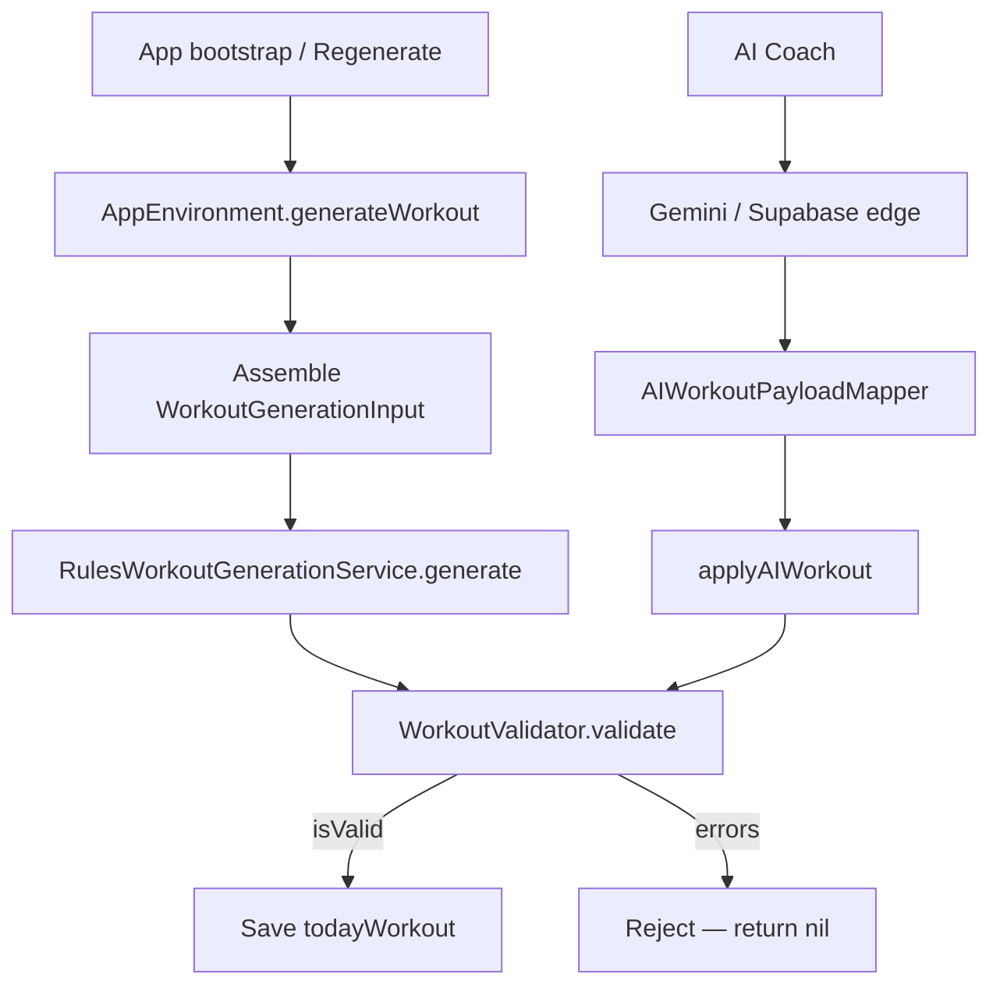

# HotBod — Exercise & Workout Generation Logic

This document describes how exercises enter the app and how daily workouts are built. It is intended for critique of the current rules engine, validation layer, and supporting algorithms.

**Primary source files:**

| Area | File |
|------|------|
| Rules engine | `HotBod/Services/WorkoutGeneration/WorkoutGenerationService.swift` |
| Orchestration | `HotBod/App/AppEnvironment.swift` |
| Split / schedule | `HotBod/Domain/Algorithms/TrainingSchedule.swift` |
| Recovery, volume, overload | `HotBod/Domain/Algorithms/Algorithms.swift` |
| Deload / volume caps | `HotBod/Domain/Algorithms/Phase2Algorithms.swift` |
| Exercise catalog & swaps | `HotBod/Domain/Algorithms/ExerciseCatalog.swift` |
| Seed loading | `HotBod/Data/Local/ExerciseCatalogLoader.swift`, `LocalExerciseRepository.swift` |
| AI coach (optional) | `HotBod/Services/AI/GeminiAIWorkoutService.swift`, `RemoteAIWorkoutService.swift` |
| Server validation | `supabase/functions/_shared/validate.ts` |

---

## 1. High-level architecture



**Key design choice:** The **rules engine** (`RulesWorkoutGenerationService`) owns the default daily plan. AI proposals are optional overlays that must pass the same client-side `WorkoutValidator` (plus server validation when using Supabase).

From `AppEnvironment`:

```5:8:HotBod/App/AppEnvironment.swift
    // Architecture: RulesWorkoutGenerationService owns the daily plan (bootstrap + regenerate).
    // Cloud coach (RemoteAIWorkoutService + Supabase edge) proposes changes; server + client
    // validation gate every apply. Safe modifyWorkout proposals auto-apply; generateWorkout and
    // failed validation keep the manual Apply flow. HealthKit sleep/resting HR inform readiness hints.
```

---

## 2. Exercises are not algorithmically generated

Exercises are **curated and seeded**, not invented at runtime.

### 2.1 Data sources

1. **`ExerciseSeed.json`** — canonical exercise list (~100+ entries): id, muscles, equipment, movement pattern, difficulty, instructions, seeded substitution links, demo videos.
2. **`ExerciseContent.json`** — overlays: substitution groups, aliases, extra instructions, explicit `substitutionGroupId`.

### 2.2 Merge pipeline

```3:8:HotBod/Data/Local/ExerciseCatalogLoader.swift
enum ExerciseCatalogLoader {
    static func loadExercises() -> [Exercise] {
        let seed = ExerciseSeedLoader.loadSeed()
        let content = loadContentBundle()
        return seed.map { merge($0, content: content.exercises[$0.id], groups: content.substitutionGroups) }
    }
```

Each seed exercise is converted via `ExerciseSeedDTO.toExercise()`. Notable: **`mechanics` and `forceType` are always `nil`** in the DTO mapper:

```120:131:HotBod/Data/Local/LocalExerciseRepository.swift
    func toExercise() -> Exercise {
        Exercise(
            id: id,
            name: name,
            ...
            forceType: nil,
            mechanics: nil,
            ...
        )
    }
```

If no `substitutionGroupId` is provided in content, one is auto-derived:

```4:7:HotBod/Domain/Algorithms/ExerciseCatalog.swift
    static func autoGroupId(for exercise: Exercise) -> String {
        let muscle = exercise.primaryMuscles.first?.rawValue ?? "general"
        return "\(muscle)_\(exercise.movementPattern.rawValue)"
    }
```

### 2.3 Example seed entry

```json
{
  "id": "bench_press",
  "name": "Bench Press",
  "primaryMuscles": ["chest"],
  "secondaryMuscles": ["shoulders", "triceps"],
  "equipment": ["barbell", "bench"],
  "movementPattern": "horizontalPush",
  "difficulty": "intermediate",
  "substitutions": ["dumbbell_press", "machine_chest_press", "push_up"]
}
```

### 2.4 User-driven exercise filtering

At runtime, exercises can be excluded via:

- `isAvoided` flag (user marked avoid in library)
- Equipment mismatch
- Injury / limitation movement-pattern blocklist
- `avoidExerciseIds` in generation options (used on regenerate for variation)

---

## 3. When workouts are generated

| Trigger | Behavior |
|---------|----------|
| App `bootstrap()` | On a training day, if no workout or workout is stale (not created today), calls `regenerateTodayWorkout` |
| User taps Regenerate | Excludes current exercise IDs, sets `preferVariation = true`; falls back without exclusions if validation fails |
| User switches split focus | Toggles `splitDayIndex`, regenerates with variation |
| Session completed | Advances split rotation, may pregenerate next day's workout |
| AI coach Apply | Runs same validator before saving |

Input assembly in `AppEnvironment.generateWorkout`:

```360:398:HotBod/App/AppEnvironment.swift
    private func generateWorkout(
        profile: UserProfile,
        splitDayFocus: SplitDayFocus,
        options: WorkoutGenerationOptions = WorkoutGenerationOptions()
    ) async -> GeneratedWorkout? {
        let summaries = (try? await workoutRepository.fetchSessionSummaries()) ?? []
        let stats = (try? await exerciseStatsRepository.fetchStats()) ?? []
        let recovery = Dictionary(uniqueKeysWithValues: recoveryStates.map { ($0.muscleGroup, $0.recoveryPercentage) })
        let soreness = options.soreness ?? sorenessLevel
        let duration = options.targetDurationMinutes ?? profile.preferredSessionLengthMinutes

        let input = WorkoutGenerationInput(
            userProfile: profile,
            goal: profile.goal,
            experienceLevel: profile.experienceLevel,
            availableEquipment: profile.availableEquipment,
            targetDurationMinutes: duration,
            preferredMuscleGroups: [],
            avoidedMuscleGroups: [],
            injuries: profile.limitations,
            recentWorkouts: summaries,
            muscleRecovery: recovery,
            exerciseStats: stats,
            userPreferences: WorkoutPreferences(
                avoidExerciseIds: options.excludeExerciseIds,
                preferVariation: options.preferVariation
            ),
            readiness: ReadinessInput(
                sleepScore: healthReadiness.sleepScore,
                soreness: soreness
            ),
            splitDayFocus: splitDayFocus
        )

        guard let workout = try? await workoutGenerationService.generate(input: input) else { return nil }
        let validation = workoutGenerationService.validate(workout: input, input: input)
        lastValidation = validation
        guard validation.isValid else { return nil }
        return workout
    }
```

**Update note:** `preferredMuscleGroups` / `avoidedMuscleGroups` are now populated from profile and applied by the rules engine.

---

## 4. Rules engine pipeline (`RulesWorkoutGenerationService`)

### Step 1 — Filter available exercises

```7:13:HotBod/Services/WorkoutGeneration/WorkoutGenerationService.swift
        let allExercises = try await exerciseRepo.fetchAll()
        let available = allExercises.filter { exercise in
            !exercise.isAvoided &&
            exercise.equipment.allSatisfy { input.availableEquipment.contains($0) || $0 == .bodyweight } &&
            exercise.equipment.contains(where: { input.availableEquipment.contains($0) }) &&
            !violatesInjuries(exercise, injuries: input.injuries)
        }
```

**Equipment rule:** Every required piece must be available (bodyweight is always allowed). At least one equipment tag must match user inventory.

**Injury blocklist** (movement-pattern + contraindication text checks):

```184:196:HotBod/Services/WorkoutGeneration/WorkoutGenerationService.swift
    private func violatesInjuries(_ exercise: Exercise, injuries: [BodyLimitation]) -> Bool {
        guard !injuries.contains(.none) else { return false }
        let risky: [BodyLimitation: [MovementPattern]] = [
            .shoulder: [.verticalPush, .horizontalPush],
            .lowerBack: [.hinge, .squat],
            .knee: [.squat, .lunge]
        ]
        for injury in injuries {
            if let patterns = risky[injury], patterns.contains(exercise.movementPattern) {
                return true
            }
        }
        return false
    }
```

**Update note:** Elbow, wrist, hip, ankle, and neck are mapped in `GenerationConstants`, and contraindication text contributes to exclusion.

---

### Step 2 — Select target muscles (`selectTargetMuscles`)

Logic branches:

#### A. Soreness penalty on recovery map

```99:104:HotBod/Services/WorkoutGeneration/WorkoutGenerationService.swift
        if input.readiness?.soreness == .severe {
            recovery = recovery.mapValues { max(0, $0 - 20) }
        } else if input.readiness?.soreness == .moderate {
            recovery = recovery.mapValues { max(0, $0 - 10) }
        }
```

#### B. If split day focus is set (normal path)

Uses `TrainingSchedule.muscles(for:)`:

```52:60:HotBod/Domain/Algorithms/TrainingSchedule.swift
    static func muscles(for focus: SplitDayFocus) -> [MuscleGroup] {
        switch focus {
        case .upper: [.chest, .back, .shoulders, .biceps, .triceps]
        case .lower: [.quads, .hamstrings, .glutes, .calves]
        case .push: [.chest, .shoulders, .triceps]
        case .pull: [.back, .biceps]
        case .legs: [.quads, .hamstrings, .glutes, .calves]
        case .fullBody: MuscleGroup.allCases
        }
    }
```

From those split muscles, pick up to 4 with recovery ≥ 40%, sorted by recovery %. If fewer than 2 qualify, fall back to top 4 by recovery regardless of threshold.

#### C. If no split focus (fallback)

1. Exclude muscles trained in last 2 workouts
2. Require recovery ≥ 50%
3. If ≥ 3 ready muscles:
   - For `upperLower` or `pushPullLegs`: compare average upper vs lower recovery, return top 3 from the fresher half
   - Else: top 4 ready muscles
4. Ultimate fallback: top 4 muscles by recovery across all groups

**Update notes:**
- `sleepScore` is used as a recovery penalty signal in generator sorting/intensity constraints.
- `preferredMuscleGroups` / `avoidedMuscleGroups` are applied during target and candidate selection.

---

### Step 3 — Select exercises (`selectExercises`)

**Exercise count from duration:**

```swift
let maxExercises = min(8, max(4, durationMinutes / 8))
// 32 min → 4 exercises, 45 min → 5, 60 min → 7, 64+ min → 8
```

**Scoring:**

```154:158:HotBod/Services/WorkoutGeneration/WorkoutGenerationService.swift
        let scored = filtered.map { exercise -> (Exercise, Double) in
            let muscleScore = Double(exercise.primaryMuscles.filter { targetMuscles.contains($0) }.count) * 10
            let statBonus = stats.contains { $0.exerciseId == exercise.id } ? 2.0 : 0.0
            let difficultyPenalty = exercise.difficulty == .advanced && experience == .beginner ? -5.0 : 0.0
            return (exercise, muscleScore + statBonus + difficultyPenalty)
        }.sorted { $0.1 > $1.1 }
```

**Variation shuffle** (regenerate / prefer variation):

```161:165:HotBod/Services/WorkoutGeneration/WorkoutGenerationService.swift
        if !avoidIds.isEmpty || preferVariation {
            ranked.shuffle()
            ranked.sort { $0.1 > $1.1 }
        }
```

Ties among equal scores become random after shuffle — intentional variety, but can pick suboptimal exercises within the same score band.

**Selection constraints:**

```167:180:HotBod/Services/WorkoutGeneration/WorkoutGenerationService.swift
        for (exercise, _) in ranked where selected.count < maxExercises {
            if usedPatterns.contains(exercise.movementPattern) && selected.count >= 2 { continue }
            if exercise.primaryMuscles.contains(where: { targetMuscles.contains($0) }) {
                selected.append(exercise)
                usedPatterns.insert(exercise.movementPattern)
            }
        }

        if selected.count < 4 {
            for (exercise, _) in ranked where !selected.contains(exercise) {
                selected.append(exercise)
                if selected.count >= 4 { break }
            }
        }
```

- After 2 exercises, duplicate **movement patterns** are skipped (diversity rule).
- Must match at least one target primary muscle.
- If still &lt; 4 exercises, backfill from ranked list **without** muscle/pattern constraints.

**Critique notes:**
- No explicit compound-before-isolation ordering.
- No guarantee each target muscle gets coverage.
- Secondary muscles are ignored in scoring.
- `favoriteExerciseIds` on `WorkoutPreferences` is unused.

---

### Step 4 — Plan sets, reps, weight, rest

For each selected exercise:

#### Rep ranges (goal + experience, overridden by history)

```207:212:HotBod/Services/WorkoutGeneration/WorkoutGenerationService.swift
    private func repRange(for goal: TrainingGoal, experience: ExperienceLevel) -> (Int, Int) {
        switch goal {
        case .gainStrength: (4, 6)
        case .loseFat: (12, 15)
        default: experience == .beginner ? (10, 12) : (8, 10)
        }
    }
```

If user has `UserExerciseStats` for the exercise, `preferredRepRangeMin/Max` from prior sessions win.

#### Set count

```215:217:HotBod/Services/WorkoutGeneration/WorkoutGenerationService.swift
    private func setCountFor(experience: ExperienceLevel, pattern: MovementPattern) -> Int {
        let base = experience == .beginner ? 2 : 3
        return [.squat, .hinge, .horizontalPush, .horizontalPull].contains(pattern) ? base + 1 : base
    }
```

#### Weight

- **With history:** `ProgressiveOverload.nextWeight` using `stats.planningWeightKg` (`suggestedNextWeightKg ?? lastWeightKg`)
- **Without history:** flat defaults by experience + barbell flag:

```199:204:HotBod/Services/WorkoutGeneration/WorkoutGenerationService.swift
    private func defaultWeight(for exercise: Exercise, experience: ExperienceLevel) -> Double {
        switch experience {
        case .beginner: exercise.equipment.contains(.barbell) ? 40 : 12
        case .intermediate: exercise.equipment.contains(.barbell) ? 60 : 20
        case .advanced: exercise.equipment.contains(.barbell) ? 80 : 28
        }
    }
```

**Note:** `ProgressiveOverload.suggestedStartWeight` (bodyweight × movement pattern × experience) exists in `Algorithms.swift` but is **not used** by the rules engine — only the flat defaults above.

#### Deload adjustment

```248:258:HotBod/Services/WorkoutGeneration/WorkoutGenerationService.swift
    private func deloadAdjustment(
        baseSetCount: Int,
        stats: UserExerciseStats?
    ) -> (intensity: IntensityTarget, setCount: Int) {
        guard let stats = stats, stats.isInDeloadWeek else {
            return (.moderate, baseSetCount)
        }
        let reducedSets = max(1, Int(Double(baseSetCount) * 0.6))
        return (.light, reducedSets)
    }
```

Weight is also reduced 10% in `ProgressiveOverload.nextWeight` when `isInDeloadWeek`.

#### Rest periods

```swift
restSeconds: exercise.mechanics == .compound ? 120 : 90
```

Because seeded exercises have `mechanics: nil`, this almost always resolves to **90s** unless mechanics are set elsewhere.

#### Every set gets RPE target 8

```60:61:HotBod/Services/WorkoutGeneration/WorkoutGenerationService.swift
                targetSets: (0..<adjustedSetCount).map { _ in
                    PlannedSet(targetRepsMin: minReps, targetRepsMax: maxReps, targetWeightKg: weight, rpeTarget: 8)
```

---

### Step 5 — Metadata

**Title** — from split focus, or inferred upper/lower/full, or PPL label:

```220:230:HotBod/Services/WorkoutGeneration/WorkoutGenerationService.swift
    private func workoutTitle(for muscles: [MuscleGroup], split: TrainingSplit, focus: SplitDayFocus?) -> String {
        if let focus {
            return "\(focus.displayName) Strength"
        }
        let lower = Set([MuscleGroup.quads, .hamstrings, .glutes, .calves])
        if muscles.allSatisfy({ lower.contains($0) }) { return "Lower Body Strength" }
        if muscles.allSatisfy({ !lower.contains($0) }) { return "Upper Body Strength" }
        switch split {
        case .pushPullLegs: return "Push Day Hypertrophy"
        default: return "Full Body Strength"
        }
    }
```

**Duration estimate:**

```233:236:HotBod/Services/WorkoutGeneration/WorkoutGenerationService.swift
    private func estimateDuration(exercises: [PlannedExercise]) -> Int {
        let totalSets = exercises.reduce(0) { $0 + $1.targetSets.count }
        let restMinutes = exercises.reduce(0) { $0 + ($1.restSeconds * max(0, $1.targetSets.count - 1)) } / 60
        return totalSets * 2 + restMinutes + 5
    }
```

Assumes ~2 min per set (work time) + inter-set rest + 5 min buffer.

---

## 5. Progressive overload & volume tracking

Updated after each completed session via `ProgressiveOverload.updateStats` in `Algorithms.swift`.

### Session-based weight suggestion (simple path)

```197:209:HotBod/Domain/Algorithms/Algorithms.swift
    static func nextWeight(
        currentWeight: Double,
        completedAllSetsAtTopRange: Bool,
        missedMinimumReps: Bool
    ) -> Double {
        if completedAllSetsAtTopRange {
            return currentWeight + 2.5
        }
        if missedMinimumReps {
            return (currentWeight * 0.95 * 10).rounded() / 10
        }
        return currentWeight
    }
```

### Trend-based weight suggestion (used at generation time)

```212:242:HotBod/Domain/Algorithms/Algorithms.swift
    static func nextWeight(
        current: Double,
        stats: UserExerciseStats,
        volumeCap: Int,
        setCountThisWeek: Int,
        bodyweight: Double
    ) -> Double {
        if stats.isInDeloadWeek { return current * 0.9 }
        if stats.volumeTrend == .decreasing { return current }
        if setCountThisWeek >= volumeCap { return current * 0.95 }
        if stats.volumeTrend == .increasing {
            let increment = current < 20 ? current * 0.025 : 2.5
            return round((current + increment) * 2.0) / 2.0
        }
        let increment = current < 20 ? current * 0.05 : 5.0
        return round((current + increment) * 2.0) / 2.0
    }
```

### Weekly volume cap

```291:314:HotBod/Domain/Algorithms/Phase2Algorithms.swift
enum VolumeCapCalculator {
    static func baseWeeklySetCap(bodyweight: Double) -> Int {
        max(20, Int(150.0 + (0.5 * bodyweight)))
    }

    static func adjustedWeeklySetCap(bodyweight: Double, soreness: SorenessLevel) -> Int {
        let baseCap = baseWeeklySetCap(bodyweight: bodyweight)
        let reductionFactor: Double = {
            switch soreness {
            case .none: 1.0
            case .mild: 0.9
            case .moderate: 0.8
            case .severe: 0.6
            }
        }()
        return Int(Double(baseCap) * reductionFactor)
    }
}
```

For 80 kg: base cap = 190 sets/week (total across all exercises' set counts).

### Deload detection

`DeloadDetector` flags deload when:
- Volume drops &gt; 30% week-over-week, OR
- 3 consecutive weeks with &gt; 15% volume increases

---

## 6. Muscle recovery model

### Passive recovery over time

```10:23:HotBod/Domain/Algorithms/Algorithms.swift
    static func decayRecovery(
        states: [MuscleRecoveryState],
        experienceLevel: ExperienceLevel,
        hoursSinceReference: Double = 0
    ) -> [MuscleRecoveryState] {
        let rate = experienceLevel.recoveryRatePerHour
        return states.map { state in
            ...
            updated.recoveryPercentage = min(100, state.recoveryPercentage + hours * rate)
            ...
        }
    }
```

Recovery rates: beginner 2.2%/hr, intermediate 1.8%/hr, advanced 1.5%/hr.

### Fatigue from completed work

```26:47:HotBod/Domain/Algorithms/Algorithms.swift
    static func applyWorkoutFatigue(
        states: [MuscleRecoveryState],
        exercises: [Exercise],
        completedSets: [(exercise: Exercise, sets: [CompletedSet])]
    ) -> [MuscleRecoveryState] {
        ...
            let intensityMultiplier = item.exercise.mechanics == .compound ? 1.2 : 0.8
            let contributions = muscleContributions(for: item.exercise)
            ...
                let fatigue = Double(workingSets.count) * intensityMultiplier * contribution * 8
                state.recoveryPercentage = max(0, state.recoveryPercentage - fatigue)
```

Primary muscles contribute 1.0, secondary 0.4 per `muscleContributions`.

### Global soreness

```61:67:HotBod/Domain/Algorithms/Algorithms.swift
    static func applySoreness(states: [MuscleRecoveryState], level: SorenessLevel) -> [MuscleRecoveryState] {
        ...
            updated.recoveryPercentage = max(0, state.recoveryPercentage - level.recoveryPenalty)
```

Penalties: mild −5, moderate −15, severe −30 (percentage points).

---

## 7. Validation (`WorkoutValidator`)

Validation runs **after** generation. Hard errors block the workout (`isValid = errors.isEmpty`).

### Hard errors (examples)

| Check | Threshold |
|-------|-----------|
| Exercise count | &lt; 4 |
| Duplicate exercise IDs | any duplicate |
| Unknown exercise ID | not in catalog |
| Injury conflict | same pattern blocklist as generation |
| Equipment | required gear not in profile |
| Rep range | min &lt; 1, max &gt; 30, min &gt; max |
| Per-muscle recovery | &lt; 15% for a targeted primary muscle |
| Severe soreness | always errors |
| Min recovery across all muscles | &lt; 15% |
| Projected weekly volume | &gt; 180 sets |

### Soft warnings (workout still valid)

- Moderate/mild soreness
- Low recovery (15–30%)
- Weekly volume 150–180 sets
- High intensity + low average recovery
- Duration exceeds target + 20 min

**Critique note:** Validator can flag problems (e.g. severe soreness) that the generator **does not proactively avoid** — it still builds the workout and then rejects it at the `AppEnvironment` gate.

---

## 8. Exercise substitution (swap, not generation)

When user swaps an exercise mid-session, `ExerciseCatalog.substitutes` ranks alternatives:

1. Same `substitutionGroupId` (from content or auto `muscle_pattern`)
2. Seeded `substitutions` links on the exercise
3. Algorithmic: same primary muscle overlap + same movement pattern, scored by:

```54:59:HotBod/Domain/Algorithms/Phase2Algorithms.swift
    static func scoreSubstitute(_ source: Exercise, _ candidate: Exercise) -> Double {
        var score = 0.0
        score += Double(Set(source.primaryMuscles).intersection(Set(candidate.primaryMuscles)).count) * 10
        score += source.movementPattern == candidate.movementPattern ? 5 : 0
        score += source.difficulty == candidate.difficulty ? 2 : 0
        return score
    }
```

Same equipment/injury filters as generation.

---

## 9. Training split rotation

```42:49:HotBod/Domain/Algorithms/TrainingSchedule.swift
    static func splitSequence(for split: TrainingSplit) -> [SplitDayFocus] {
        switch split {
        case .upperLower: [.upper, .lower]
        case .pushPullLegs: [.push, .pull, .legs]
        case .fullBody: [.fullBody]
        case .arnold: [.push, .pull, .legs]
        case .bodyPart, .custom, .adaptive: [.upper, .lower]
        }
    }
```

`splitDayIndex` advances after each completed session. `bodyPart`, `custom`, and `adaptive` splits currently behave like upper/lower.

---

## 10. AI generation path (secondary)

### Gemini (direct, if API key configured)

Prompt asks for JSON with 4–8 exercises. Exercise IDs use **hyphenated slugs** in the prompt (`"barbell-back-squat"`) but the seed catalog uses **underscores** (`bench_press`) — mapping depends on `AIWorkoutPayloadMapper`.

### Supabase cloud coach

Server system prompt restricts to `ALLOWED_EXERCISES` list and validates via `validate.ts` (simpler than client validator: no per-muscle recovery, no weekly volume projection).

AI workouts must pass `applyAIWorkout` → client `WorkoutValidator` before saving.

---

## 11. Known gaps & critique checklist

Use this section when reviewing the logic:

| Topic | Current behavior | Possible concern |
|-------|------------------|------------------|
| Exercise catalog | Static JSON seed | No runtime exercise creation; quality depends entirely on seed curation |
| `mechanics` | Seeded when available, inferred from movement pattern otherwise | Low risk; monitor coverage as seed expands |
| `preferredMuscleGroups` | Populated from profile | Confirm UX guidance so users understand bias behavior |
| `avoidedMuscleGroups` | Populated from profile | Ensure warning copy remains clear when override path triggers |
| `favoriteExerciseIds` | Applied in scoring bonus | Validate bonus weighting vs variation goals |
| Injury mapping | Pattern rules cover all current `BodyLimitation` values + contraindication text checks | Continue moving toward structured per-exercise contraindications |
| Sleep score | Applied as recovery/intensity penalty signal | Keep tuning thresholds as readiness data quality improves |
| Default weights | Uses movement-pattern and bodyweight-aware `suggestedStartWeight` | Track edge cases for missing bodyweight/equipment data |
| Exercise ordering | Score order only | No compound-first or pre-fatigue logic |
| Muscle coverage | Best-effort scoring | May under-train some target muscles |
| Variation shuffle | Random within score ties | Can feel arbitrary |
| Validator vs generator | Generate then reject | Severe soreness / fatigue can produce nil workout with no fallback softening |
| Weekly volume cap | 150 + 0.5×BW sets | Very high threshold; validator hard-errors at 180 projected |
| PPL title | "Push Day Hypertrophy" even for strength goals | Naming mismatch |
| `bodyPart` / `custom` / `adaptive` splits | `bodyPart -> push/pull/legs`, `custom -> fullBody`, `adaptive -> dynamic focus` | Legacy-safe defaults now explicit; revisit when custom split builder ships |
| AI exercise IDs | Hyphen vs underscore risk | Potential validation failures for AI paths |

---

## 12. `WorkoutGenerationInput` reference

```399:414:HotBod/Domain/Models/DomainModels.swift
struct WorkoutGenerationInput: Codable {
    let userProfile: UserProfile
    let goal: TrainingGoal
    let experienceLevel: ExperienceLevel
    let availableEquipment: [Equipment]
    let targetDurationMinutes: Int
    let preferredMuscleGroups: [MuscleGroup]
    let avoidedMuscleGroups: [MuscleGroup]
    let injuries: [BodyLimitation]
    let recentWorkouts: [WorkoutSessionSummary]
    let muscleRecovery: [MuscleGroup: Double]
    let exerciseStats: [UserExerciseStats]
    let userPreferences: WorkoutPreferences
    let readiness: ReadinessInput?
    let splitDayFocus: SplitDayFocus?
}
```

---

## 13. Full rules engine source

The complete implementation lives in one file (~387 lines):

`HotBod/Services/WorkoutGeneration/WorkoutGenerationService.swift`

It contains:
- `RulesWorkoutGenerationService` — generation
- `WorkoutValidator` — post-generation safety checks

Unit tests: `HotBod/Tests/UnitTests/HotBodTests.swift` → `WorkoutGenerationTests`, `WorkoutValidator` tests, progressive overload tests.
